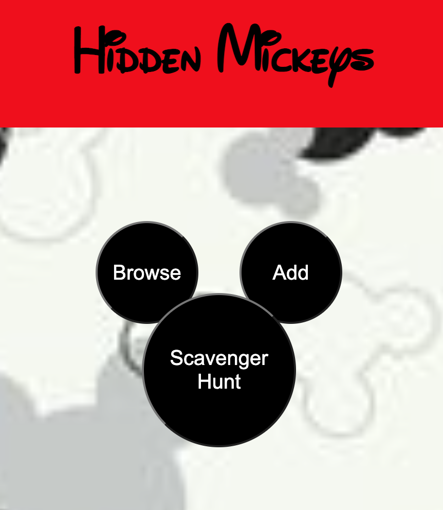
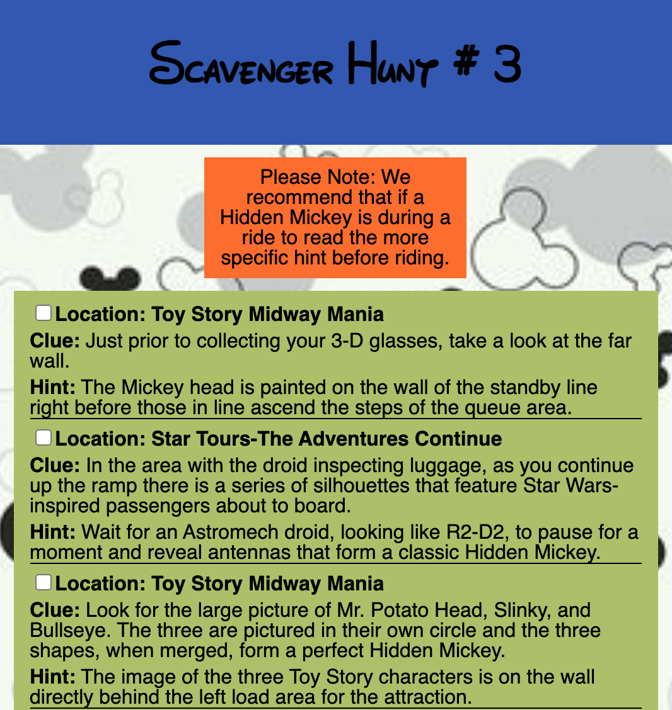

# [HiddenMickey] (https://hidden-mickey.herokuapp.com/)

As an avid Disney goer and Scavenger Hunt enthusiast, I wanted an app that I could take into the park with me and be able to enjoy a new Scavenger Hunt of different Hidden Mickeys located throughout the parks. 

This app follows the [CRUD](https://developer.mozilla.org/en-US/docs/Glossary/CRUD) (Create, Read, Update, Delete) method. So it gives the user the opportunity to View all the Hidden Mickeys based on the Park and Area of the Park they choose. The user also has the opportunity to Add new Hidden Mickeys, Update the info on incorrect Hidden Mickeys, and Delete Hidden Mickeys that are no longer located in the Parks.

The following technologies were used:

The back-end was an API that was developed in C# using [LINQ](https://docs.microsoft.com/en-us/dotnet/csharp/programming-guide/concepts/linq/) with [Entity Framework](https://docs.microsoft.com/en-us/dotnet/framework/data/adonet/ef/overview).

The front-end was a [React](https://reactjs.org/) app that [fetched](https://handbook.suncoast.io/lessons/misc-quick-reference/js-fetch) data from the API and support multiple pages with React Router.

